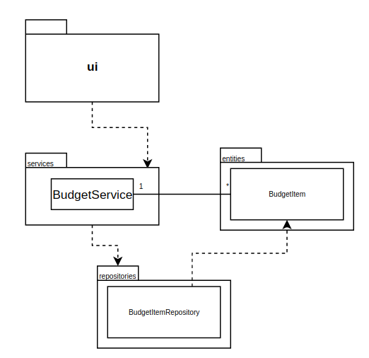
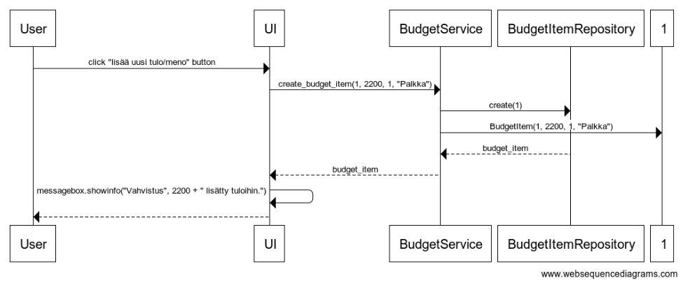

# Arkkitehtuurikuvaus

## Sovelluslogiikka

`BudgetService`-sovelluslogiikasta vastaavan luokan, sekä muun ohjelman suhdetta esittävä luokka/pakkauskaavio:

## Uuden tulon/menon lisääminen

Kun lisää uusi -näkymässä on valittu tulo tai meno, syötetty summa, sekä kuvaus ja painetaan "Lisää uusi" -painiketta etenee sovellluksen kontrolli näin:

