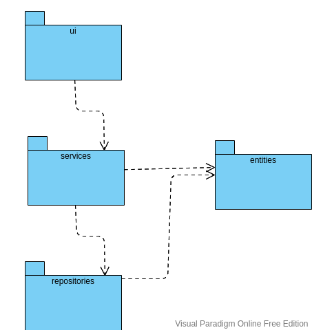

# Arkkitehtuurikuvaus

## Rakenne

Ohjelman rakenne on tehty noudattamaan kolmitasoista kerrosarkkitehtuuria. Koodin pakkausrakenne on seuraava:

Käyttöliitymästä vastaava koodi sisältyy pakkaukseen _ui_, sovelluslogiikasta vastaa koodi pakkaukseen _services_ ja tietojen tallennuksesta vastaava koodi pakkaukseen _repositories_. Sovelluksen käyttämiä tietokohteita sisältävät luokat kuuluvat pakkaukseen _entities_.

## Käyttöliittymä

Käyttöliittymässä on kolme erillistä näkymää:

- Kotinäkymä
- Uuden tulon tai menon lisääminen
- Tulo- ja menoerittely

Nämä on kaikki toteutettu omina luokkinaan. Näkyvänä on aina luokka kerrallaan. [GUI](https://github.com/ereborinkorppi/ot-harjoitustyo/blob/master/src/ui/gui.py)-luokka vastaa näkymien näyttämisestä. Käyttöliittymä on yritetty pitää erillään sovelluslogiikasta. Käyttöliittymästä kutsuutaan ainoastaan [BudgetService](https://github.com/ereborinkorppi/ot-harjoitustyo/blob/master/src/services/budget_service.py)-luokan metodeja.

Lisäksi käyttöliittymässä käytetään _Tkinter.messagebox_ moduulia, näyttämään onnistuneita lisäyksiä, sekä virheilmoituksia.

## Sovelluslogiikka

`BudgetService`-sovelluslogiikasta vastaavan luokan, sekä muun ohjelman suhdetta esittävä luokka/pakkauskaavio:

## Tietojen tallennus

Pakkauksen _repositories_ luokka `BudgetItemRepository` vastaa tietojen tallettamisesta SQLite-tietokantaan.

Luokka on tehty [Repository](https://en.wikipedia.org/wiki/Data_access_object) -mallia noudattaen ja se voidaan niin haluattaessa korvata erilaisella toteutuksella.

Budjetin tulo- ja menotapahtumat tallennetaan SQLite-tietokannan tauluun `budget`. Tietokannan alustus tapahtuu [initialize_database.py](https://github.com/ereborinkorppi/ot-harjoitustyo/blob/master/src/initialize_database.py) -tiedostossa.

## Päätoiminnallisuudet

Alla on kuvattuna sovelluksen toimintalogiikkaa (nyt) yhden päätoiminnallisuuden osalta sekvenssikaaviona.

### Uuden tulon/menon lisääminen

Kun lisää uusi -näkymässä on valittu tulo tai meno, syötetty summa, sekä kuvaus ja painetaan "Lisää uusi" -painiketta etenee sovellluksen kontrolli näin:

