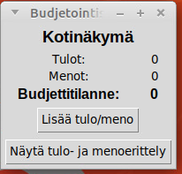

# Käyttöohje

Lataa sovelluksen tuoreimman [releasen](https://github.com/ereborinkorppi/ot-harjoitustyo/releases) lähdekoodi menemällä Assets -osion alle ja sieltä Source code.

## Sovelluksen käynnistäminen

Ennen sovelluksen ensimmäistä käynnistämistä, riippuvuudet asennetaan komennolla:

```
poetry install
```

Esimmäisellä kerralla myös alustetaan ohjelma (luodaan tietokanta valmiiksi):

```
poetry run invoke build
```

Tämän jälkeen sovellus käynnistetään komennolla:

```
poetry run invoke start
```

## Kotinäkymä

Sovellus käynnistyy kotinäkymään:



Kotinäkymässä voi tarkastella budjettia ylätasolla, siirtyä lisäämään uusia tulo tai menoja "Lisää tulo/meno" painikkeella, sekä siirtyä tarkastelemaan tulojen ja menojen erittelyä "Näytä tulo- ja menoerittely" painikkeella.

## Uuden tulon tai menon lisääminen

Lisää uusi -näkymässä käyttäjä voi luoda uuden tulo- tai menotapahtuman.

Tämä tapahtuu valitsemalla radio buttonista tulo tai meno, syöttämällä summa ja kuvaus, sekä painamalla "Lisää uusi" painiketta.

Näkymästä pääsee takaisin kotinäkymään "Takaisin" painikkeella.


Jos käyttäjän luominen onnistuu, siirrytään siirrytään käyttäjän tekemättömät työt listaavaan näkymään.

## Tulo- ja menoerittely

Tulo- ja menoerittely näkymässä voi vain tarkastella yksittäisiä kirjauksia.

Näkymästä pääsee takaisin kotinäkymään "Takaisin" painikkeella.

