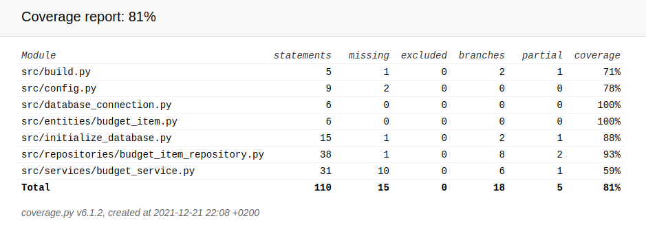

# Testausdokumentti

Unittestin avulla on suoritettu automatisoidusti ohjelman yksikkö- ja integraatiotestausta. Tämän lisäksi järjestelmätason testaus on tehty manuaalisesti.

## Yksikkö- ja integraatiotestaus

### Sovelluslogiikka

`BudgetService`-luokkaa, joka vastaa sovelluslogiikasta testataan [TestBudgetService](https://github.com/ereborinkorppi/ot-harjoitustyo/blob/master/src/tests/budget_service_test.py)-testiluokalla. `BudgetService`-olio alustetaan siten, että sille annetaan riippuvuudeksi repositorio-olio, joka tallentaa tietoa muistiin tietokannan sijaan. `FakeBudgetItemRepository` -luokka on tehty tätä käyttötarkoitusta varten.

### Repositorio-luokka

Repositorio-luokkaa `BudgetItemRepository` testataan erikseen testikäyttöön tarkoitetulla tietokannalla, joka on konfiguroitu _.env.test_-tiedostoon. `BudgetItemRepository`-luokan testauksesta vastaa [TestBudgetItemRepository](https://github.com/ereborinkorppi/ot-harjoitustyo/blob/master/src/tests/budget_item_repository_test.py)-testiluokka.

### Testikattavuus

Testauksen haarautumakattavuus on 81% (käyttöliittymää lukuunottamatta)

Niistä osista joita olisi pitänyt testata testaamatta jäi mm. tulo- ja meno listauksien hakeminen. _build.py_- ja _initialize\_database.py_-tiedostojen suorittaminen komentoriviltä jäivät myös testaamatta (tosin nämä olisi voinut jättää testikattavuuden ulkopuolelle).

## Järjestelmätestaus

Sovelluksen järjestelmätestit on suoritettu manuaalisesti.

### Asennus

[käyttöohjetta](https://github.com/ereborinkorppi/ot-harjoitustyo/blob/master/dokumentaatio/kayttohje.md) noudattaen sovellus on haettu ja testattu erilaisissa Linux-ympäristöissä.

Erilaisia konfiguraatioita ei ole testattu.

### Toiminnallisuudet

Kaikki [vaatimusmäärittelydokumentin](https://github.com/ereborinkorppi/ot-harjoitustyo/blob/master/dokumentaatio/vaatimusmaarittely.md#perusversion-tarjoama-toiminnallisuus) ja käyttöohjeeseen listatut toiminnallisuudet on testattu. Lisää uusi -toiminnallisuuden kenttiin on kokeiltu syöttää virheellisiä (tyhjiä, väärää formaattia yms.) arvoja ja näistä pitäisi tulla järkevä ilmoitus.
