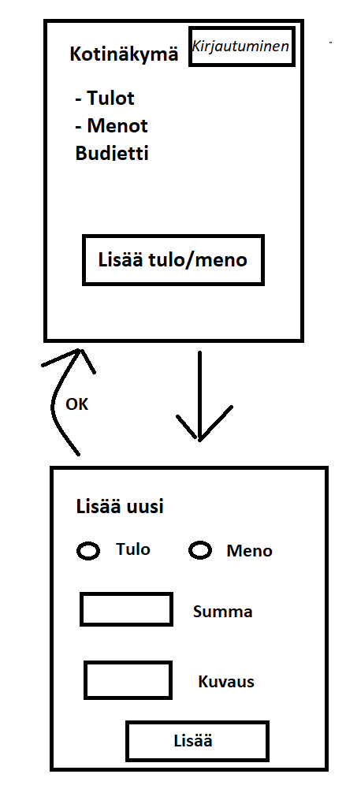

# Vaatimusmäärittely

## Sovelluksen tarkoitus

Sovelluksen on tarkoitus mahdollistaa kotitalouden budjetointi eli kirjata tulot ja menot, sekä tarkkailla niitä. 

## Käyttäjät

Aluksi sovellukseen tulee vain yhdenlaisia käyttäjiä eli _normaali käyttäjä_, joka voi toimia ilman kirjautumista, sillä tarkoitus on, että kaikki taloudessa voivat lisätä sekä nähdä tulot ja menot. Myöhemmin saatetaan tehdä laajemmat oikeudet omaava kirjautumisen vaativa _ylläpitäjä_ joka voisi luoda uusia luokkia (mikäli sellaiset tehdään), sekä muokata ja poistaa tietoja.

## Käyttöliittymäluonnos

Sovellus koostuu aluksi kahdesta eri näkymästä

Sovellus aukeaa kotinäkymään, jossa näkee budjettitilanteen ja siitä voi siirtyä lisäämään uusia tuloja ja menoja. Mahdollinen ylläpitäjän kirjautuminen tulee tähän näkymään myös.

## Perusversion tarjoama toiminnallisuus

### Normaalikäyttäjänä

- Tarkastella budjettia (tuloja ja menoja kotinäkymässä)
  - Tulot ja menot listattuna kotinäkymään
  - Laskettu mitä budjettiin jää viivan alle tulojen ja menojen mukaan
- Siirtyä uuden tulon tai menon lisäykseen
  - lisätä uuden tulon
  - lisätä uuden menon

## Jatkokehitysideoita

Kun nämä perustoiminnallisuudet on toteutettu, on mahdollisuuksien mukaan tarkoitus lisätä mm. seuraavia toiminnallisuuksia:

- Kirjautuminen ylläpitäjälle
  - Joka voi poistaa ja muokata tuloja, sekä menoja
- Tulojen ja menojen ryhmittely omiin luokkiin
  - Ylläpitäjä voi luoda uudet tulo- ja menoluokat
  - Tulojen ja menojen tarkastelu luokittain
- Tulojen ja menojen ryhmittely kuukausittain
  - Kalenteritoiminnallisuuden lisääminen
  - Tulojen ja menojen lisääminen kuukausitasolla
  - Tulojen ja menojen tarkastelu kuukausitasolla
 
 ## Tehty 2.12.2021 mennessä
 
 - Tulot ja menot näkyvät kotinäkymässä ylätasolla
 - Budjettitilanne eli mitä viivan alle jää näkyy kotinäkymässä
 - Voi siirtyä lisäämään tuloja ja menoja
 - Tulon ja menon lisäys toimii 
 - 2.12. lisätty uuden tulon ja menon kuvaus kenttä (menoja ja tuloja ei tosin vielä pääse tarkastelemaan listana joten lisätty kenttä ei näy sovelluksessa, mutta tallentuu kantaan.)
