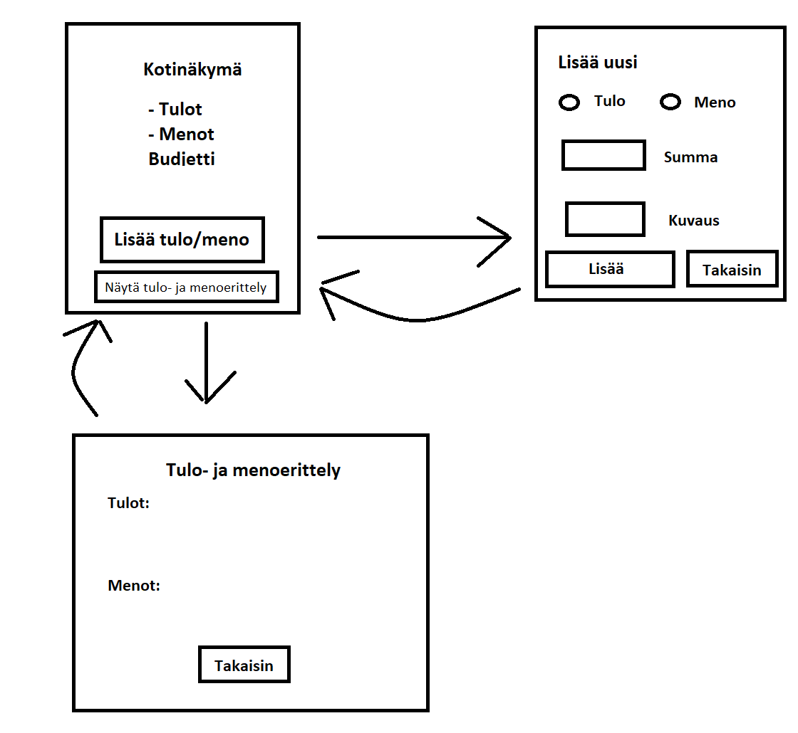

# Vaatimusmäärittely

## Sovelluksen tarkoitus

Sovelluksen on tarkoitus mahdollistaa kotitalouden budjetointi eli kirjata tulot ja menot, sekä tarkkailla niitä summattuna ja eriteltynä. 

## Käyttäjät

Aluksi sovellukseen tulee vain yhdenlaisia käyttäjiä eli _normaali käyttäjä_, joka voi toimia ilman kirjautumista, sillä tarkoitus on, että kaikki taloudessa voivat lisätä sekä nähdä tulot ja menot. Jatkokehityksenä saatetaan tehdä laajemmat oikeudet omaava kirjautumisen vaativa _ylläpitäjä_ joka voisi myös muokata ja poistaa tietoja, sekä luoda/muokata/poistaa tuloja ja menoja yhdistäviä luokkia.

## Käyttöliittymäluonnos

Sovellus koostuu kolmesta eri näkymästä

Sovellus aukeaa kotinäkymään, jossa näkee summatut tulot, sekä menot ja budjettitilanteen. Kotinäkymästä voi siirtyä lisäämään uusia tuloja ja menoja tai tarkastelemaan tulo- ja menoerittelyä. Lisää uusi ja tulo- ja menoerittelynäkymistä pääsee takaisin kotinäkymään.

## Perusversion tarjoama toiminnallisuus

### Normaalikäyttäjänä

- Voi tarkastella budjettia ylätasolla
  - Tulot ja menot näkyy yhteen summattuina kotinäkymässä
  - Lisäksi on laskettu mitä budjettiin jää viivan alle kun tuloista vähennetään menot
- Siirtyä uuden tulon tai menon lisäykseen
  - lisätä uuden tulon
  - lisätä uuden menon
- Siirtyä tulo- ja menoerittelynäkymään
  - näkee kaikki kirjatut tulot eriteltyinä
  - näkee kaikki kirjatut menot eriteltyinä

## Jatkokehitysideoita

Näiden perustoiminnallisuuksien lisäksi voisi sovellusta laajentaa mahdollisuuksien mukaan mm. lisäämällä seuraavia toiminnallisuuksia:

- Kirjautuminen ylläpitäjälle
  - Joka voi poistaa ja muokata tuloja, sekä menoja
- Tulojen ja menojen ryhmittely luokittain
  - Ylläpitäjä voi luoda uudet tulo- ja menoluokat
  - Tulojen ja menojen tarkastelu luokittain
- Tulojen ja menojen ryhmittely kuukausittain
  - Kalenteritoiminnallisuuden lisääminen
  - Tulojen ja menojen lisääminen kuukausitasolla
  - Tulojen ja menojen tarkastelu kuukausitasolla
